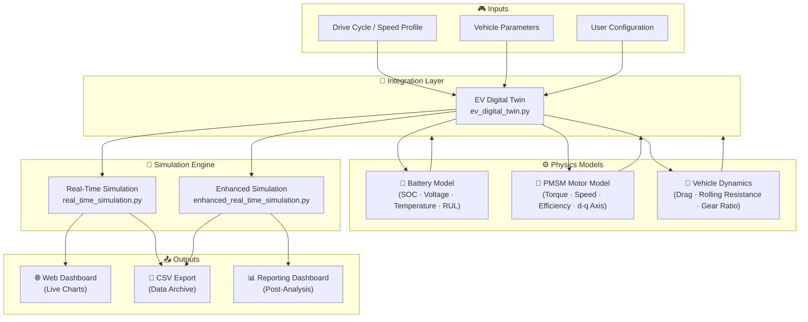
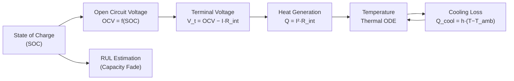
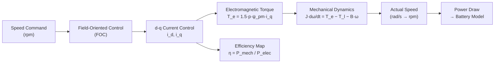
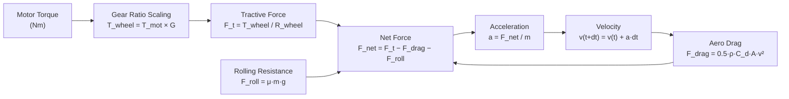
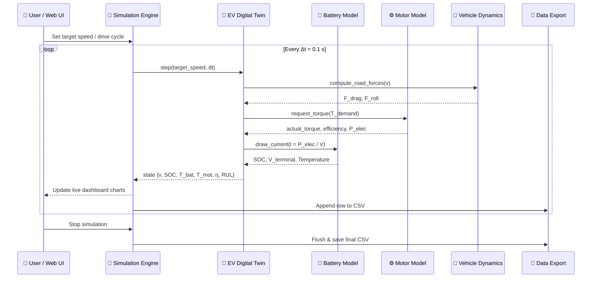
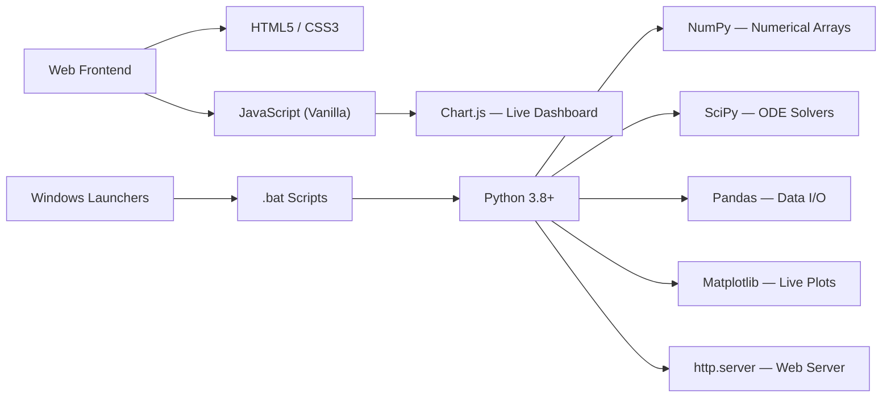

# ⚡ AutoPulse — Electric Vehicle Digital Twin (Windows Edition)

> A high-fidelity, real-time **Electric Vehicle Digital Twin** that integrates physics-based battery and motor models with an interactive web dashboard — engineered for simulation, analysis, and predictive maintenance research.

[](https://www.python.org/)
[](https://www.microsoft.com/windows)
[](LICENSE)
[]()

---

## 📋 Table of Contents

1. [Overview](#overview)
2. [Key Features](#key-features)
3. [System Architecture](#system-architecture)
4. [Component Breakdown](#component-breakdown)
5. [Data Flow & Simulation Workflow](#data-flow--simulation-workflow)
6. [Project Structure](#project-structure)
7. [Installation](#installation)
8. [Usage](#usage)
9. [Configuration Parameters](#configuration-parameters)
10. [Tech Stack](#tech-stack)

---

## Overview

**AutoPulse** is a modular, physics-based digital twin platform for electric vehicles. It replicates the real-time behaviour of an EV's powertrain — from lithium-ion battery electrochemistry to PMSM motor electrodynamics — and exposes the live simulation state through an interactive browser-based dashboard.

The platform is designed for:
- **EV Powertrain Research** — Validate battery and motor control strategies before hardware deployment.
- **Predictive Maintenance** — Track Remaining Useful Life (RUL) of battery packs and motor windings.
- **Drive Cycle Analysis** — Replay standard or custom drive cycles and observe energy consumption patterns.
- **Education & Prototyping** — A self-contained environment to learn EV physics without hardware.

---

## Key Features

| Feature | Description |
|---|---|
| 🔋 Battery Digital Twin | SOC, voltage, current, temperature tracking with thermal dynamics |
| ⚙️ PMSM Motor Model | d-q axis 3-phase motor model with torque, speed, and efficiency curves |
| 🚗 Vehicle Dynamics | Aerodynamic drag, rolling resistance, gear ratio, and road force integration |
| 📊 Real-Time Dashboard | Live charts via web browser — no extra software needed |
| 🔮 RUL Prediction | Data-driven Remaining Useful Life estimation for battery and motor |
| 📁 Data Export | Simulation runs automatically exported to CSV for offline analysis |
| 🪟 Windows-Native | One-click `.bat` launchers — no CLI knowledge required |

---

## System Architecture

The platform is decomposed into three independent physics layers that feed into a central integration layer, which in turn drives the real-time simulation and web interface.



---

## Component Breakdown

### 🔋 Battery Model

Implements a simplified electrochemical model of a lithium-ion cell / pack.



**Key parameters modelled:**
- State of Charge (SOC) via Coulomb counting
- Terminal voltage with internal resistance drop
- Thermal dynamics (heat generation + convective cooling)
- Capacity fade for degradation / RUL tracking

---

### ⚙️ PMSM Motor Model

Implements a Permanent Magnet Synchronous Motor in the rotating d-q reference frame.



**Key parameters modelled:**
- d-q axis stator inductances and resistance
- Permanent magnet flux linkage (ψ_pm)
- Rotor inertia and friction torque
- 3-phase current/voltage reconstruction
- Motor efficiency at each operating point

---

### 🚗 Vehicle Dynamics

Links motor torque output to real-world vehicle motion.



---

## Data Flow & Simulation Workflow

This diagram shows the full lifecycle of one simulation time step — from user input to data export.



---

## Project Structure

```
AutoPulse_ev_digital_twin_windows/
│
├── README.md                          ← You are here
│
└── ev_digital_twin_windows/
    └── ev_digital_twin/
        │
        ├── 🔋 battery_model/
        │   ├── simplified_battery_model.py    # Core battery electrochemical model
        │   ├── enhanced_battery_model.py      # Extended model with degradation
        │   └── battery_dfn_model.py           # Doyle-Fuller-Newman (DFN) model
        │
        ├── ⚙️  motor_model/
        │   ├── simplified_pmsm_motor_model.py # d-q axis PMSM model
        │   ├── enhanced_motor_model.py        # Extended model with thermal effects
        │   └── pmsm_motor_model.py            # Full-order PMSM model
        │
        ├── 🔗 integration/
        │   ├── ev_digital_twin.py             # Core integration class (main model)
        │   └── enhanced_ev_digital_twin.py    # Enhanced integration with RUL
        │
        ├── 📡 simulation/
        │   ├── real_time_simulation.py        # Real-time sim engine + live plots
        │   └── reporting_dashboard.py         # Post-run analysis & report generation
        │
        ├── 🌐 web_interface/
        │   ├── index.html                     # Main live dashboard
        │   ├── launcher.html                  # Simulation launcher UI
        │   ├── parameter_setup.html           # Vehicle parameter config UI
        │   └── launch_with_parameters.py      # Web server for the dashboard
        │
        ├── 📄 data_export/                    # Auto-generated simulation CSVs
        │
        ├── 📚 docs/                           # Full technical documentation
        │
        ├── 🖥️  bat/                           # Windows one-click launchers
        │   ├── run_ev_digital_twin.bat        # ⭐ Recommended all-in-one launcher
        │   ├── start_enhanced_ev_digital_twin.bat
        │   └── start_web_interface.bat
        │
        ├── enhanced_ev_launcher.py            # Enhanced Python launcher
        ├── enhanced_real_time_simulation.py   # Standalone enhanced simulation
        ├── web_interface_launcher.py          # Web server bootstrap
        └── motor_rul.js                       # Motor RUL JS module
```

---

## Installation

### Prerequisites

| Requirement | Version |
|---|---|
| Windows | 10 or 11 (64-bit) |
| Python | 3.8 or higher |
| pip | Latest |

### Setup

```bash
# 1. Clone the repository
git clone https://github.com/Mohammedosama111/AutoPulse_ev_digital_twin_windows.git
cd AutoPulse_ev_digital_twin_windows

# 2. (Recommended) Create a virtual environment
python -m venv venv
venv\Scripts\activate

# 3. Install dependencies
pip install numpy pandas matplotlib scipy
```

---

## Usage

### Option A — One-Click Windows Launcher (Recommended)

Navigate to `ev_digital_twin_windows/ev_digital_twin/bat/` and double-click:

```
run_ev_digital_twin.bat
```

This launches the Python backend **and** opens the web dashboard in your default browser automatically.

### Option B — Python CLI

```python
from integration.ev_digital_twin import ElectricVehicleDigitalTwin
from simulation.real_time_simulation import RealTimeEVSimulation

# Build the digital twin
ev = ElectricVehicleDigitalTwin(
    battery_capacity=75.0,       # kWh
    motor_power=150.0,           # kW
    vehicle_mass=2000.0,         # kg
)

# Run real-time simulation
sim = RealTimeEVSimulation(ev_model=ev)
sim.run()
```

### Option C — Web Interface with Custom Parameters

```bash
cd ev_digital_twin_windows/ev_digital_twin
python web_interface_launcher.py
# Open http://localhost:8080 in your browser
```

---

## Configuration Parameters

| Parameter | Default | Unit | Description |
|---|---|---|---|
| `battery_capacity` | 75.0 | kWh | Total usable energy capacity |
| `battery_nominal_voltage` | 400.0 | V | Pack nominal voltage |
| `motor_power` | 150.0 | kW | Peak motor power |
| `motor_nominal_speed` | 8000.0 | rpm | Base speed (corner point) |
| `vehicle_mass` | 2000.0 | kg | Kerb weight |
| `wheel_radius` | 0.33 | m | Loaded tyre radius |
| `gear_ratio` | 9.0 | — | Motor-to-wheel gear ratio |
| `drag_coefficient` | 0.28 | — | Aerodynamic C_d |
| `frontal_area` | 2.3 | m² | Frontal cross-section |
| `rolling_resistance` | 0.01 | — | Tyre rolling resistance μ |

---

## Tech Stack



---

## Author

**Mohammed Osama**
- GitHub: [@Mohammedosama111](https://github.com/Mohammedosama111)
- Email: mo0441880@gmail.com

---

*Built with physics, Python, and a passion for clean energy systems.*
